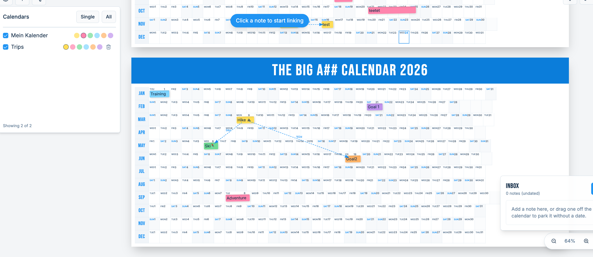

# Big Year Calendar (365 Calendar)

A year-at-a-glance planner with a zoomable 365‑day view and sticky notes.



## Features

- 365‑day year grid with zoom/pan
- Sticky notes per day
- Optional Google Calendar live sync (read-only, while app is open)
- Optional sign-in + sync via Supabase
- Shared calendars / public sharing (when Supabase is configured)

## Local development

Prereqs: Node.js 18+ and npm (or Bun).

```sh
npm install
npm run dev
```

Other useful commands:

```sh
npm run lint
npm run build
npm run preview
```

## Legal pages (Imprint / Privacy)

- The app includes `/imprint` and `/privacy` as a popup modal (with a close button).
- Configure contact details via env vars (see `.env.example`): `VITE_LEGAL_PROVIDER_NAME`, `VITE_LEGAL_PROVIDER_ADDRESS` (newline-separated), `VITE_LEGAL_PHONE`, `VITE_LEGAL_EMAIL`, `VITE_LEGAL_WEBSITE`.

## Environment variables (Supabase)

Without Supabase env vars, the app still runs, but sign-in and persistence are disabled.

Create `.env.local`:

```env
VITE_SUPABASE_URL=https://YOUR_PROJECT_REF.supabase.co
VITE_SUPABASE_PUBLISHABLE_KEY=YOUR_SUPABASE_ANON_KEY
```

## Google Calendar sync (optional)

Set `VITE_GOOGLE_CLIENT_ID` to enable connecting a Google account and showing Google Calendar events inside the year view.

## Database migrations (Supabase)

Apply the SQL migrations in `supabase/migrations` to your Supabase project (includes shared calendars and sharing-related tables/policies).

If you use the Supabase CLI, a typical flow is:

```sh
supabase link --project-ref YOUR_PROJECT_REF
supabase db push
```

## Auth (Supabase)

This app uses email + password auth. If your Supabase project requires email confirmation on sign-up, customize the template:

- Supabase Dashboard → Authentication → Templates → `Confirm signup`
- Optional: use `supabase/email-templates/magic-link.html` as a starting point (it uses `{{ .ConfirmationURL }}`)

If you previously used magic-link sign-in, use the password reset flow in the app (`/reset-password`) to set a password for your existing account.

If password reset emails fail (e.g. 500 "Error sending recovery email"), configure email delivery in Supabase:

- Supabase Dashboard → Authentication → Logs (look for SMTP/mailer errors)
- Supabase Dashboard → Authentication → Providers → Email (SMTP settings / rate limits)
- Supabase Dashboard → Authentication → URL Configuration (ensure your site URL / redirect URLs include `/reset-password`)

## Tech stack

- Vite + React + TypeScript
- Tailwind CSS + shadcn/ui
- Supabase (auth + data)

## License

Proprietary — see `LICENSE`.
